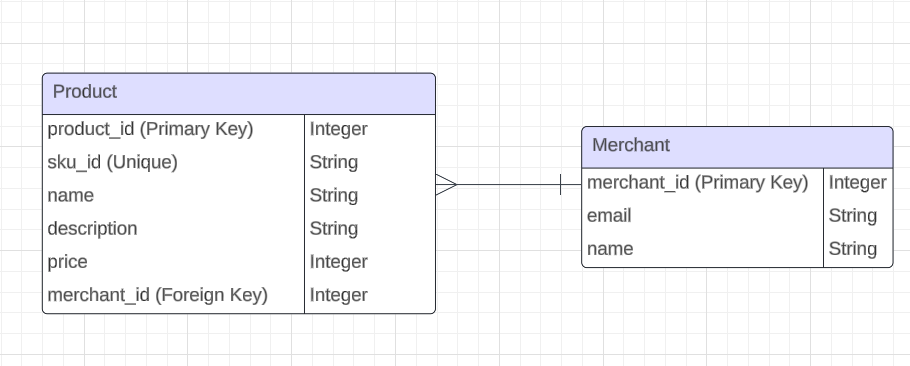

# ShopAnythingLagos (SAL) Product Management API for Question 1

This API allows merchants to manage their product listings on the ShopAnythingLagos (SAL) platform. Merchants can perform CRUD (Create, Read, Update, Delete) operations on their products through RESTful endpoints provided by the API.

## Table of Contents

- [Endpoints](#endpoints)
- [Request and Response Formats](#request-and-response-formats)
- [Error Handling](#error-handling)
- [Setup and Installation](#setup-and-installation)

## Endpoints

### Display all products listed by a merchant

`GET /products/:merchantId`

Retrieves all products listed by a specific merchant.

### Create a product for a merchant

`POST /products/:merchantId`

Creates a new product for a specific merchant. The request body must contain the following fields:

- `sku_id` (string|number): The unique identifier for the product provided by the merchant.
- `name` (string): The name of the product.
- `description` (string): The description of the product.
- `price` (number): The price of the product.

### Edit an existing product

`PATCH /products/:merchantId/:sku_id`

Edits an existing product for a specific merchant. The request body can contain the following fields to update:

- `name` (string): The updated name of the product.
- `description` (string): The updated description of the product.
- `price` (number): The updated price of the product.

### Delete an existing product

`DELETE /products/:merchantId/:sku_id`

Deletes an existing product for a specific merchant.

## Request and Response Formats

### Request Format

Requests must be sent in JSON format. For example:

```json
{
  "sku_id": "ABC123",
  "name": "Product Name",
  "description": "Product Description",
  "price": 99
}
```

Response Format
Responses are sent in JSON format and contain the following fields:

status (string): Indicates the status of the operation (success or error).

data (object/array): Contains the data returned by the API endpoint (if any).

message (string): A descriptive message providing additional information about the operation.

### Example Response:

```json
{
	"status": "success",
	"message": "Product created successfully",
	"data": {
		"sku_id": "ABC123",
		"name": "Product Name",
		"description": "Product Description",
		"price": 99.99,
		"created_on": "2024-02-21T12:00:00.000Z"
	}
}
```

### Error Handling

Errors are returned with appropriate status codes and error messages in JSON format. Possible error responses include:

400 Bad Request: Indicates that the request was malformed or missing required fields.

404 Not Found: Indicates that the requested resource (e.g., merchant or product) was not found.

### Setup and Installation

Ensure you have [NodeJs](https://nodejs.org/en) installed

`git clone https://github.com/sircatalyst/ShopAnythingLagos.git`

`npm install`

`npm start`

The API server will start running port `3000` by default.


# ShopAnythingLagos (SAL) Product Management API for Question 2


## - How can you design the database for this particular problem for performance given that you have a large number of merchants?


## - What would inform your choice of a database when solving this particular problem?
Some of the factors to consider while choosing a database system this particular problem is high performance, scalability, and flexibility of such database. Sql databases (such as PostgreSQL and MySQL) and NoSQL databases (such as MongoDB) are ideal for this problem. They provide features such as ACID (atomicity, consistency, isolation, and durability) compliance, support for complex queries, and are easy of scale.